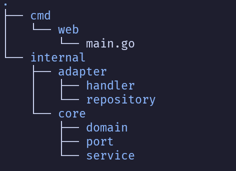

# PoC Go Hexagonal



- `cmd`: diretório para os principais pontos de entrada, injeção dependência ou comandos do aplicativo. O subdiretório web contém o ponto de entrada principal a API REST.
- `internal`: diretório para conter o código do aplicativo que não deve ser exposto a pacotes externos.
- `core`: diretório que contém a lógica de negócios central do aplicativo.
  - `domain`: diretório que contém modelos/entidades de domínio que representam os principais conceitos de negócios.
  - `port`: diretório que contém interfaces ou contratos definidos que os adaptadores devem seguir.
  - `service`: diretório que contém Serviços de Domínio ou Use Cases.
- `adapters`: diretório para conter serviços externos que irão interagir com o core do aplicativo
  - `handler`: diretório que contém os controllers e manipulador de requisições REST.
  - `repository`: diretório que contém adaptadores de banco de dados exemplo para PostgreSQL.


## Bibliotecas

[Gin Web Framework](https://gin-gonic.com/)

```shell
go get -u github.com/gin-gonic/gin
```

[GitHub - gin-contrib/cors: Official CORS gin's middleware](http://github.com/gin-contrib/cors)

```shell
go get github.com/gin-contrib/cors
```

[slog package - log/slog - Go Packages](https://pkg.go.dev/log/slog)

[Goenv](https://github.com/joho/godotenv)

```shell
go get github.com/joho/godotenv
```

## Referencias

https://github.com/bagashiz/go-pos